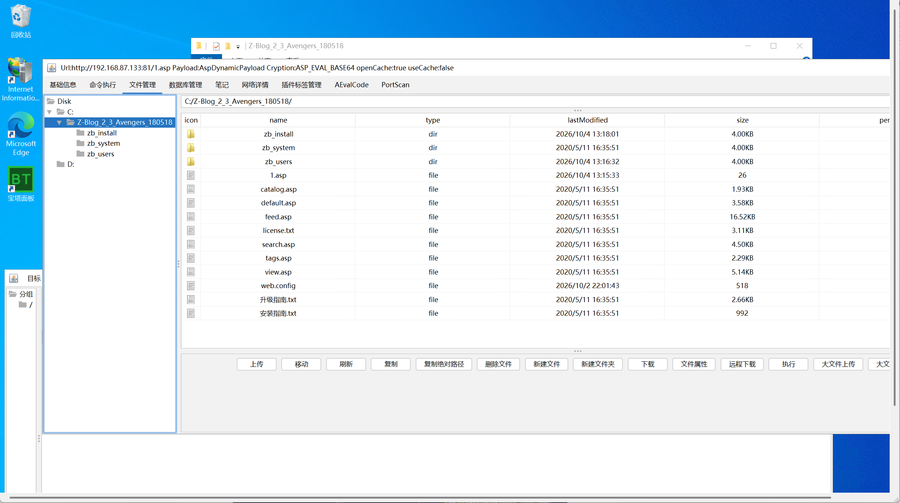
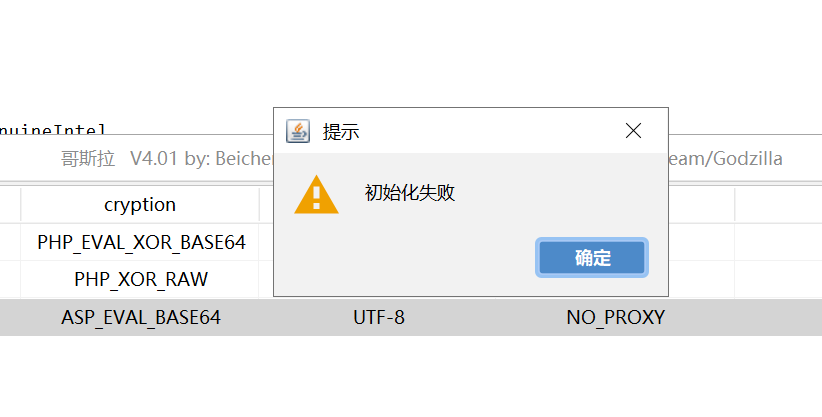
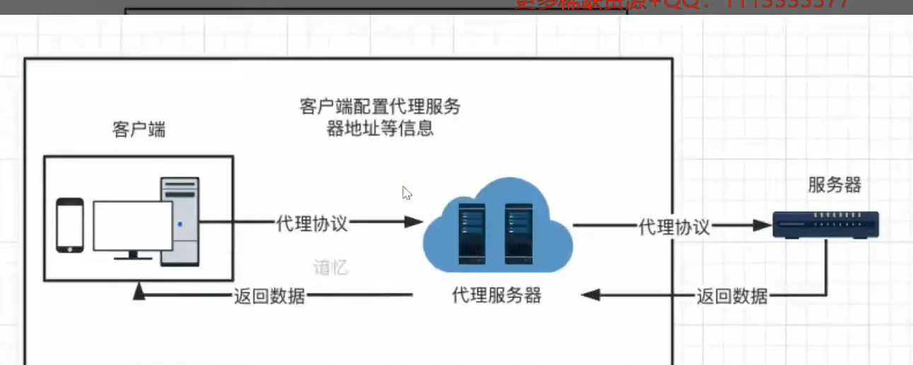
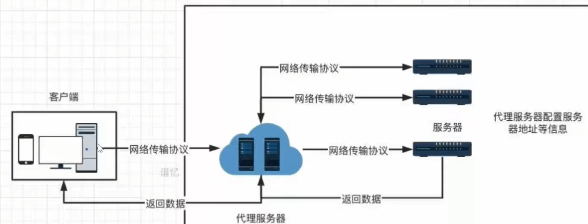
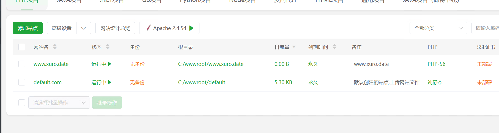
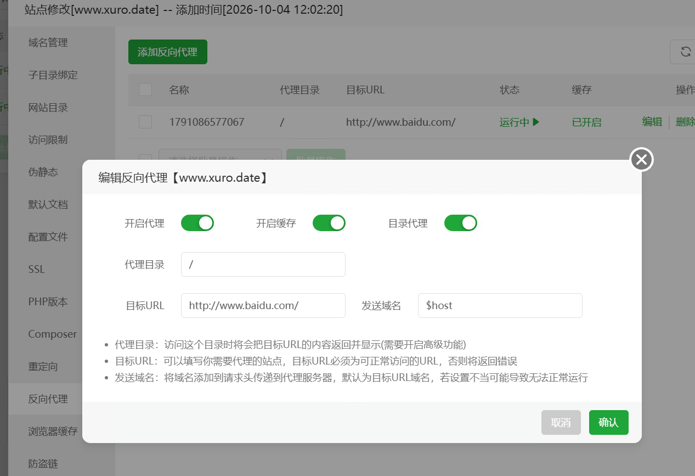
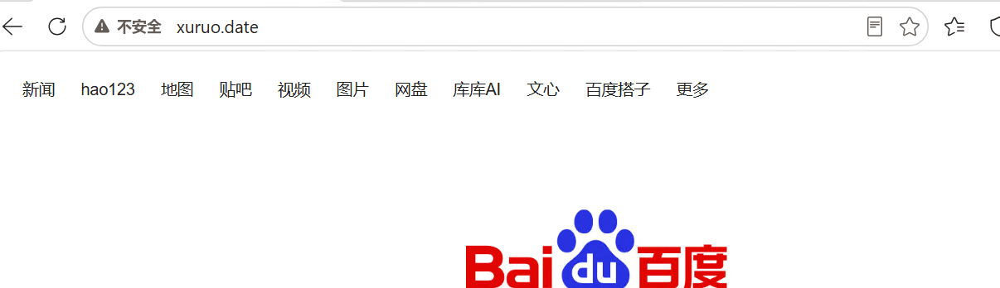

# WAF

防火墙，拦截脚本的使用

哥斯拉生成后门并连接，成功访问

开启d盾后，工具无法访问

# CDN

网站布置服务器地址影响访问速度，比如服务器在河南的忘记在广东访问就很慢。开发CDN服务就会在广东附近部署节点，提高 访问速度。这会导致_真实IP_被隐藏测试目标错误。演示需要备案域名

# OSS

额外存储的，

# 反向代理

客户端想访问外网服务器内容，需要代理服务器，正向代理是通过代理服务器返回的数据访问

反向代理则是服务端主动向代理服务器发送数据再传给客户端收到请求去访问配置的百度，百度服务器将数据发给代理服务器再发给客户端 

用宝塔演示反向代理，客户端向`xuruo.date`发送请求。通过宝塔在服务器设置的代理

配置反向代理，地址为百度

此时访问域名就是百度的页面

造成的影响会 无法显示的页面也真实后台毫无关系

# 负载均衡

是为了提高访问速度，多台服务器提供服务，防止一台发生意外无法访问。**在测试中多个服务器提供服务，会存在很多目标**